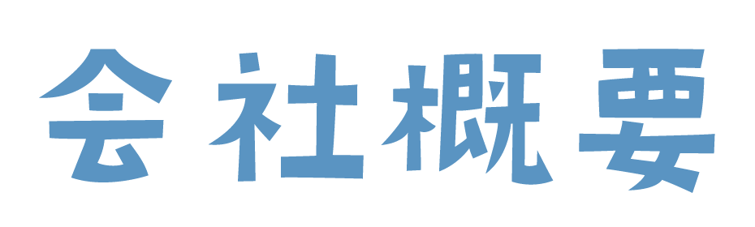
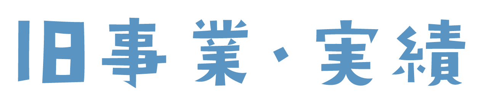
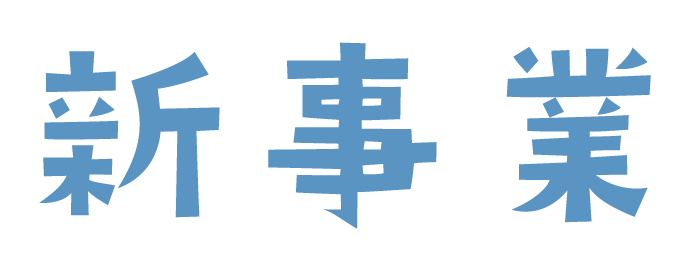

## 

### 設立

2008 年 12 月

### 所在地

東京都港区麻布台 1-8-10 麻布偕成ビル 6F

### ウェブサイト

https://catch-ball.co.jp/

### 受賞歴

文化庁メディア芸術祭、ONESHOW、ADFEST、BRAIN ONLINE VIDEO AWARD、広告電通賞、コードアワード Yahoo!JAPAN インターネットクリエイティブアワード、東京インタラクティブ･アド･アワード、Japan YouTube Ads Leaderboard

--

### 関連会社・法人株主

株式会社バスキュール https://bascule.co.jp/  

あらゆるモノゴトの体験価値の増幅・拡張に挑むクリエイティブスタジオ、383 以上の受賞歴
  

***

### 詳しく教えて
```
「KIBO 宇宙放送局」国際宇宙ステーション「きぼう」日本実験棟に開設した、宇宙と地上を双方向でつなぐ世界で唯一の宇宙放送局、「THE ISS METAVERSE」国際宇宙ステーションのリアルタイム位置情報と連携する宇宙を舞台にしたデジタルツインメタバース、「THE FIRST SPACE SUNRISE 2022」世界初！宇宙から NFT を発行・販売するプロジェクト、「This is 嵐 LIVE 2020.12.31」史上最大規模のオンライン配信ライブ、「SUBARU Digital Innovation Lab」クルマとテクノロジーの未来をデザインする共創 R&D プロジェクト、ドバイ万博の日本館展示、音声 AR 技術など、前人未到といえるプロジェクトを成功させている。
```
---

## 

## デジタル PR

### デジタルに特化した、職人的リサーチ・リスト作成とアプローチ

 - #### ネタの可能性を引き出す  
 
 - #### デジタル・ソーシャル時代　 多様な相手それぞれに、自分ごととして届く形に 

 - #### メディアリサーチの徹底

--

### 食品関連 クライアント・ブランド・プロジェクト<br><br>

日清食品（All-in PASTA/All-in NOODLES、カップヌードル「SAMURAI, FUJIYAMA, CUPNOODLE」、ラ王袋麺「値段のないラーメン屋」、オンラインストア「PRODUCT X」）、サントリー（GREEN DAKARA、プレミアムモルツ「Hey Jude by YAZAWA」、「DNA GLASS」）、雪印メグミルク（雪印コーヒー「オレたちの“ゆきこたん”プロジェクト」）、Mars（スニッカーズ「#アイドルを取り戻せ」）、えだまめ（SAKEICE）、森永製菓（in ゼリー「社会に in ゼリー」）、日清ヨーク（十勝のむヨーグルト）、アサヒフーズ（ミンティア「MY MINTIA MAKER」）、日清シスコ（ココナッツサブレ「五五七二三二〇」）、コカ・コーラ（ミニッツメイド）、キリン（グリーンラベル「GREEN JUKEBOX」「GREEN NAME」、のどごし、世界の Kitchen から）、ロッテ（Fit's）、大塚製薬（ポカリスエット「ポカリガチダンス選手権」、オロナミン C）、STARBUCKS、ドミノ・ピザ「Pizza Tracking Show」、明治（R-1「体調第一家族」「君と免疫。展」）

--

### 行政、その他 クライアント・ブランド・プロジェクト<br><br>

別府市「湯園地」、佐賀県「佐賀海苔主役祭り」「23 時の佐賀飯アニメ」、JA 宮崎経済連「宮崎牛 赤富士」、すみだ／京都水族館「LOVE 推しペン超選挙」、安川電機「YASKAWA BUSHIDO PROJECT」、Samsung（GALAXY SII「SPACE BALLOON PROJECT」）、TOYOTA（TOYOTA GAZOO Racing、「TOYOTA BARISTA」、「ソーシャルヒッチハイク」）、NTT ドコモ（「i モード卒業公演」、新機種発表会）

--

## CGM 事業

当社が総代理店（専任・独占）としてマネタイズ支援

| 媒体名                     | URL                   | 運営                   |
| :------------------------- | :-------------------- | :--------------------- |
| Togetter                   | https://togetter.com/ | トゥギャッター株式会社 |
| 写真で一言ボケて（bokete） | https://bokete.jp/    | 株式会社オモロキ       |
| MixChannel（現ミクチャ）   | https://mixch.tv/     | 株式会社 DONUTS        |

---

##   
  

**提供サービス**

### DX コンサルティング・PoC・プロトタイピング
### データ収集・分析・活用システム開発/インテグレーション
### 導入支援・オンボーディング・チューニング・BPO

---
<!-- .element data-background="images/catchball_background.png" -->
# 特徴

--

## <span style="color:#1F95EE">① 小規模組織 プロジェクト単位</span>  

### 想定ユーザー数：1 ～ 30 人
### 予算：50 万円/スポット ～ 500 万円/年
### ＜活用イメージ＞
**目的特化型 DX システム開発**  

**データ・情報・知識の組織的活用力向上**  

**デジタルネイティブな新規事業立ち上げ**  

--

## <span style="color:#1F95EE">② チャレンジテーマ 向き合う課題</span>  

- ### **インテリジェンス・イネーブルメント**  
  みんながデータ・情報・知識を活用できるようにする  
    
  
- ### **アイディエーション・ハック（企画職向け）**  
  アイデア創出やインサイト発掘の探索効率を爆上げする  


- ### **PR×DX/AIX（PR エージェンシー/広報 PR 職向け）**  
  ツール/アプリケーションの企画/設計/開発/販売  

---
<!-- .element data-background="#C8C8C8" -->
# 背景・環境

--

## ① 激変する（した）情報流通構造

- ### **情報流通量の増大**  
  リッチ化、分散化、益々広大化するネットの海  
  
- ### **多様/多面化**  
  マルチプラットフォーム/デバイス/コミュニティ  
  
- ### **分散/フラット/ロングテール化**  
  メインストリートの消失  
   
- ### **受け身/パーソナル/タコツボ化**  
  ネットの大衆化、マッチング技術  

--

## ② データ、コンピューティングの民主化

- ### オープンソース  

  #### データ  
  #### ナレッジ  
  
- ### クラウド・コンピューティング
- ### 言語 AI/LLM
- ### 小規模組織、プロジェクト単位の DX/AIX/システム開発が可能に

---

## ケース 1  

### 菓子用包装材メーカー

#### **<span style="color:#646464">課題</span>**  

消費者トレンドとエンドユーザー（店舗）動向の把握、インサイト抽出、  
個別動向を活用した提案営業、商品企画  

#### **<span style="color:#1F95EE">ソリューション</span>**  

自社納品情報と Google ビジネスプロフィール（店舗情報、クチコミ）を突合、差分から個別の動向を把握する

--

## ケース 2  

### 大手食材メーカー

#### <span style="color:#646464">課題</span>  

業界インフルエンサーマーケティングのためのデータドリブンな実態把握と定点観測  
アプローチを想定した個別インフルエンサーの特徴・動向把握  

#### <span style="color:#1F95EE">ソリューション</span>  

SNS 情報の収集（Twitter、Instagram、Youtube のアカウント、投稿情報）  
人気店の特定（食べログ 100 名店情報）と分析  
界隈注目度スコアリング

--

## ケース 3  

### 冷凍技術コンサルティング会社

#### <span style="color:#646464">課題</span>  

業界動向と消費者動向の把握、効率的情報収集  
インサイト抽出 → 顧客コミュニケーション・情報発信や営業戦略に活用  

#### <span style="color:#1F95EE">ソリューション</span>  

SNS 情報の収集（Twitter、Instagram、Youtube のアカウント、投稿情報）  
人気店の特定（食べログ 100 名店情報）と分析  
界隈注目度スコアリング  

--

## ケース 4  

### 大手PRエージェンシー

#### <span style="color:#646464">課題</span>  

ベストセラー商品の継続  
ソーシャルハンティング業務の省力化・高度化  

#### <span style="color:#1F95EE">ソリューション</span>  

マルチソース（Twitter、Youtube、Instagram、Tiktok、Google 検索）からの自動情報取得  
類似度判定処理（bot 対策）、前後頻出分析、共起語トレンド分析、高速ビューワー実装、  
ブコメ/インサイトワードお気に入り機能、ツイート画像取得＆スライド貼付  

--

## その他ケース  
  
#### クライアントごとにカスタムされた露出内容の目検・分類・評価の自動化
  
**<span style="color:#1F95EE">→</span>** ルールベース＋ LLM を活用した入出力、ビジュアライズ、レポート生成機能  

#### Youtube チャンネルモニタリングの自動化  
  
**<span style="color:#1F95EE">→</span>** 指定Youtubeチャンネルの最新投稿の定期取得と自動内容判定・スクリーニング・通知  

---

## チームメンバー

- #### コンサルタント/PM：新甚智志
- #### データエンジニア：興梠佳代、矢口茉莉子
- #### 開発パートナー：山本翔平、吉永薫
- #### アシスタント：田原奈津美、川田歩

#### ＜採用要件＞

情報探索力、データ収集力、AI/LLM 活用力、テキストコミュニケーション力、自発/自律性・自学自習・試行錯誤・IT リテラシー・リモートワーク適性

